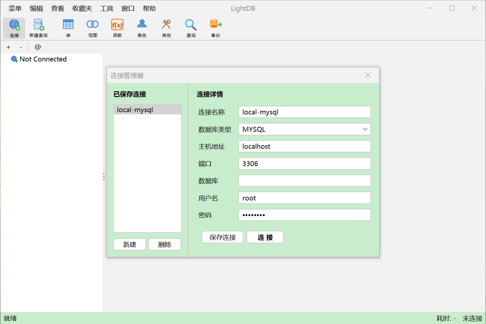
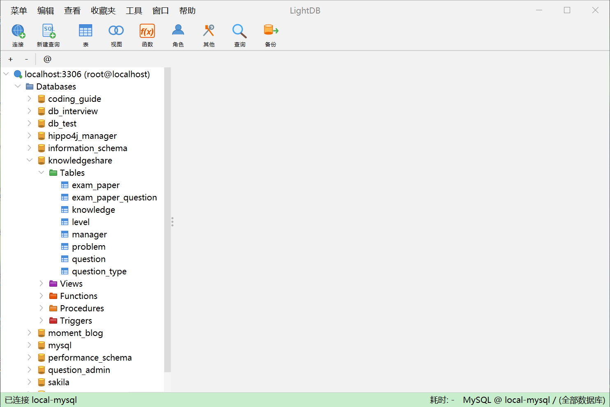
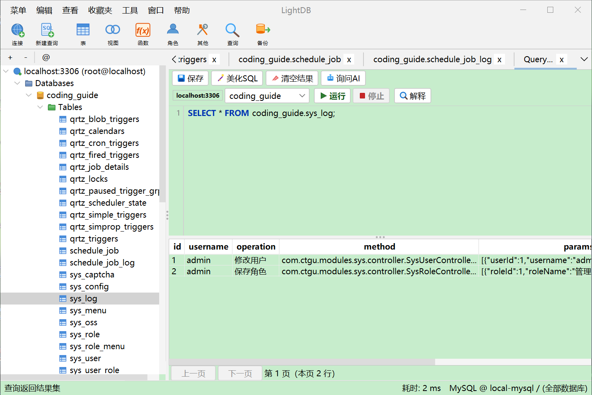
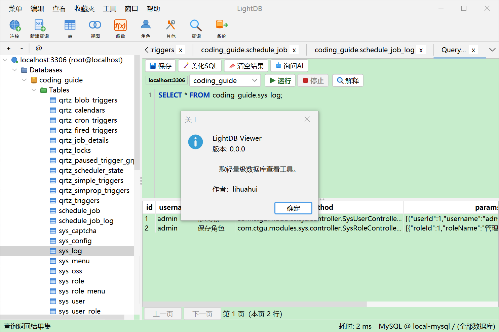

# LightDB Viewer

一款基于 Java Swing 的轻量级数据库图形化管理工具，支持 MySQL 和 PostgreSQL，提供类似 Navicat 的操作体验。

---

## 功能特性

### 已实现功能

| 功能 | 说明 |
|------|------|
| **数据库连接管理** | 支持 MySQL 8+ 和 PostgreSQL，连接信息持久化存储（密码 AES-256-GCM 加密） |
| **连接池** | 基于 HikariCP 连接池，最大 10 连接，自动健康检查，泄漏检测 |
| **对象浏览器** | 左侧懒加载树形结构，支持数据库/Schema/表/视图/函数/存储过程/触发器导航 |
| **表数据浏览与编辑** | 分页查看表数据（50/100/200/500/1000 行），支持增删改操作，事务提交 |
| **SQL 查询编辑器** | SQL 编写、执行、取消，支持参数化查询，查询历史（最近 15 条） |
| **SQL 美化** | 关键词大写 + 缩进格式化 |
| **SQL 分页** | LIMIT/OFFSET 分页，每页 200 行，最大 1000 行 |
| **表结构设计器** | 11 个子标签页：字段、索引、外键、唯一键、检查约束、排除约束、规则、触发器、选项、注释、SQL 预览 |
| **对象列表** | Tables/Views/Functions/Roles/Queries/Backup 分类只读浏览 |
| **主题切换** | 3 种基础主题 + 29 种 IntelliJ 主题 + 17 种 Material 主题 |
| **护眼背景色** | 11 种预设护眼背景色（绿豆沙、杏仁黄等） |
| **字体配置** | 独立配置 UI 字体和编辑器字体 |
| **连接导入/导出** | XML 格式，含加密密码 |
| **收藏夹** | 快速访问常用表 |
| **AI 助手** | SQL 自然语言转 SQL（NL2SQL）、SQL 解释、错误诊断（基于 LangChain4j + DeepSeek 等 API） |
| **AI 回复 Markdown 渲染** | 使用 CommonMark 解析 Markdown，JEditorPane 渲染 HTML，支持复制纯净文本和导出 .md 文件 |
| **日志系统** | SLF4J + Logback，控制台 + 滚动文件输出（30 天保留，100MB 上限） |
| **国际化框架** | 中英文资源包就绪（UI 层尚未全部接入） |
| **错误处理** | 用户友好的错误提示，SQL 状态码日志，Toast 通知 |
| **全局快捷键** | Ctrl+Enter/F5 执行 SQL，Ctrl+W 关闭标签，Esc 停止查询 |

### 待实现 / 占位功能

- 数据传输
- 数据生成
- 数据字典
- 数据同步
- 结构同步
- 历史日志
- 代码补全
- 语法高亮（当前使用纯 JTextArea）
- 自动备份

---

## 技术栈

| 层级 | 技术 |
|------|------|
| 语言 | Java 21 |
| UI 框架 | Java Swing + FlatLaf 3.4（现代扁平化 LookAndFeel） |
| 构建工具 | Maven |
| 数据库连接池 | HikariCP 5.1.0 |
| MySQL 驱动 | mysql-connector-j 8.3.0 |
| PostgreSQL 驱动 | postgresql 42.7.3 |
| 加密 | AES-256-GCM / PBKDF2 (100k 迭代) |
| 日志 | SLF4J 2.0.9 + Logback 1.4.14 |
| 测试 | JUnit 5 + Mockito + TestContainers |
| 连接序列化 | JAXB (XML)、Java Properties |
| Markdown 渲染 | CommonMark 0.21.0 |

---

## 快速开始

### 环境要求

- **开发**：JDK 21+、Maven 3.8+
- **运行 EXE**：无需安装任何 Java 环境（已捆绑精简 JRE）

### 构建与运行

```bash
# 构建 fat JAR
mvn clean package -DskipTests

# 直接运行（需要 JDK 21+）
java -jar target/navicatLike-0.0.1.jar
```

### 打包为独立 EXE（无需 JDK）

使用 `build-exe.bat` 一键打包。该脚本会：

1. `mvn clean package` → 生成 fat JAR
2. `jlink` → 生成精简 JRE（包含桌面 GUI、JDBC、SSL/TLS 等必要模块）
3. `launch4j:launch4j` → 将 JAR 嵌入 EXE，指向捆绑 JRE

```bash
# 双击运行
build-exe.bat
```

输出目录 `dist-exe/`：

```
dist-exe/
  LightDBViewer.exe           # 双击即可运行（内嵌 fat JAR）
  runtime/                    # 精简版 JRE（无需用户安装 Java）
  lightdbviewer.properties    # 配置文件
  logs/                       # 日志目录
```

> **分发**：将 `dist-exe/` 整个文件夹打包为 ZIP 即可。用户解压后双击 `LightDBViewer.exe` 直接启动。

> **技术说明**：`jlink` 模块列表来自 `jdeps` 分析结果 + 手动补充 `jdk.crypto.ec`（MySQL 8.x 默认 SSL 连接需要椭圆曲线加密）。代码中通过 `Class.forName()` 显式加载 JDBC 驱动，避免 Launch4j 非标准 classloader 导致 `ServiceLoader` 失效。

## 界面截图

> 以下截图均来自 `pic` 目录。

### 主界面与对象浏览



### 表数据浏览与编辑



### SQL 查询与结果面板



### 表结构设计



### 测试

```bash
mvn test
```

---

## 使用指南

### 连接数据库

1. 启动应用后自动弹出连接对话框
2. 从左侧列表选择已保存的连接，或填写新连接信息（名称、类型、主机、端口、数据库、用户名、密码）
3. 点击**保存连接**可持久化连接配置（密码加密存盘）
4. 点击**连接**建立连接

### 浏览对象

左侧对象树按层级组织：

```
连接名 (host:port) [user]
  └── Databases
       └── database_name
            ├── Schema（PostgreSQL 特有）
            │   ├── Tables
            │   ├── Views
            │   ├── Functions
            │   ├── Procedures
            │   └── Triggers
            └── ...（其他数据库）
```

- **双击表**：在新标签页中打开表数据
- **右键表**：弹出上下文菜单（打开 / 查询前 100 行 / 设计表 / 截断 / 刷新）
- **双击视图/函数**：生成 SELECT 查询模板

### 表数据操作

- **浏览**：分页显示，底部工具栏切换页码和每页行数
- **编辑**：直接修改单元格值，增删行
- **保存**：点击保存按钮，变更在单个事务中提交
- 变更行颜色标记：新增（绿色）、修改（黄色）、删除（红色）
- NULL 值以灰色斜体显示，主键列以粗体 + 浅灰背景标识

### SQL 查询

1. 点击工具栏**新建查询**
2. 在 SQL 编辑器中输入语句
3. 点击**运行**或 `Ctrl+Enter` / `F5` 执行
4. 结果在下方表格中分页展示
5. 点击**停止**或 `Esc` 取消正在执行的查询

### 表结构设计

双击表名进入表结构设计标签页：
- **字段**：编辑字段名、类型、长度、小数位、是否为空、主键、默认值、注释
- **索引** / **外键** / **唯一键** / **检查约束** 等：查看约束信息
- **SQL 预览**：查看生成的 ALTER TABLE SQL

### 设置

工具 → 选项（弹窗或标签页）：
- 常规：UI 字体、字号、主题、背景色
- 编辑器：编辑器字体、字号
- AI：模型选择、API 地址、API Key、最大 Token、超时
- 文件位置：配置与日志文件路径

---

## 架构设计

### 整体架构

```
MainApp (入口)
  └── AppConfig (配置单例，启动时加载 lightdbviewer.properties)
  └── ThemeManager + FontManager (主题与字体初始化)
  └── MainFrame (主窗口)
       ├── JMenuBar (菜单)
       ├── JToolBar (工具栏)
       ├── JSplitPane
        │    ├── ObjectExplorerPanel (左侧对象树，懒加载)
        │    └── WorkspaceTabs (右侧标签页工作区)
        │         ├── TableDataTab (表数据浏览/编辑)
        │         ├── QueryTab (SQL 查询)
        │         ├── DesignTableTab (表结构设计)
        │         ├── ObjectListTab (对象列表浏览)
        │         └── SettingsTab (选项设置)
        ├── AI 面板
        │    ├── Nl2SqlPanel (自然语言转 SQL)
        │    ├── SqlExplainPanel (SQL 解释)
        │    └── AiErrorDialog (错误诊断)
        └── StatusBarPanel (状态栏，含连接健康指示器)
```

### 分层设计

```
┌─────────────────────────────────────────────────┐
│  UI 层 (ui/)                                     │
│  MainFrame, ObjectExplorerPanel, WorkspaceTabs,  │
│  TableDataTab, QueryTab, DesignTableTab          │
├─────────────────────────────────────────────────┤
│  服务层 (service/ + metadata/)                    │
│  QueryService, TableDataService,                 │
│  TransactionService, MetadataService              │
├─────────────────────────────────────────────────┤
│  JDBC 层 (jdbc/)                                  │
│  ConnectionManager, JdbcExecutor,                │
│  SqlBuilder, JdbcRowWriter                        │
├─────────────────────────────────────────────────┤
│  数据库方言层 (db/)                                │
│  Dialect 接口, MySQLDialect, PostgreSQLDialect    │
├─────────────────────────────────────────────────┤
│  配置层 (config/)                                  │
│  AppConfig, PasswordCipher, SavedConnection       │
└─────────────────────────────────────────────────┘
```

### 核心设计模式

| 模式 | 应用位置 |
|------|----------|
| **单例** | AppConfig、ConnectionManager、DialectFactory |
| **策略** | Dialect 接口 + MySQLDialect / PostgreSQLDialect |
| **工厂** | DialectFactory、ToolbarIconFactory、ExplorerPopupMenuFactory |
| **模板方法** | AbstractTab 基类 |
| **观察者** | DocumentListener（SQL 变更）、TableModelListener（脏页追踪）、TreeWillExpandListener（懒加载） |
| **外观** | MetadataService 封装 DatabaseMetaData |
| **懒加载** | ObjectExplorerPanel 树节点展开时异步加载 |

### 线程模型

```
EDT (Event Dispatch Thread): UI 构造与更新、用户交互响应

后台线程:
  ├── SwingWorker: 表数据加载、SQL 执行、元数据加载
  ├── 单线程执行器: 树节点懒加载串行化
  └── 调度线程: 连接健康检查（每分钟）
```

关键规则：
- 所有数据库操作在后台线程执行，通过 SwingWorker 回调更新 UI
- 连接池操作遵循"锁内读共享状态，锁外执行 I/O"原则
- 树节点懒加载通过单线程执行器串行化，防止并发切换数据库

### 数据流

**连接流程：**
```
用户填写连接 → ConnectionDialog → MainFrame.connectTo()
  → ConnectionManager.connect(JDBC URL, user, password)
    → 创建 HikariCP 数据源 → 存入 dataSourceMap
  → ObjectExplorerPanel.refreshTree()
  → 状态栏更新连接信息
```

**表数据查询流程：**
```
双击表 → TabManager.openTable(name) → TableDataTab
  → TableDataService.loadPage(table, page, size)
    → ConnectionManager.get() → HikariCP 连接
    → SELECT * FROM table LIMIT size OFFSET offset
  → 用户编辑 → 点击保存 → JdbcRowWriter.applyChanges()
    → 事务: INSERT/UPDATE/DELETE (PreparedStatement)
```

**SQL 查询流程：**
```
SQL 编辑器 → 点击运行 → QueryTab
  → QueryService.executePaged(sql, page, size, maxRows)
    → ConnectionManager.get()
    → Statement.execute(sql + LIMIT/OFFSET)
    → 返回查询结果
  → SqlResultPanel 展示结果（支持分页）
```

---

## 项目结构

```
src/main/java/com/ctgu/lightdbviewer/
├── MainApp.java                          # 应用入口
├── config/                               # 配置层
│   ├── AppConfig.java                    # 全局配置单例
│   ├── SavedConnection.java              # 连接信息 DTO
│   ├── PasswordCipher.java               # AES-256-GCM 密码加密
│   └── ConnectionImportExport.java       # 连接导入/导出
├── db/                                   # 数据库方言层
│   ├── DbType.java                       # 数据库类型枚举
│   ├── Dialect.java                      # 方言接口（13 方法）
│   ├── DialectFactory.java               # 方言工厂
│   ├── MySQLDialect.java                 # MySQL 方言实现
│   └── PostgreSQLDialect.java            # PostgreSQL 方言实现
├── jdbc/                                 # JDBC 操作层
│   ├── ConnectionManager.java            # HikariCP 连接池管理器
│   ├── JdbcExecutor.java                 # SQL 执行器
│   ├── SqlBuilder.java                   # 安全 SQL 构建
│   └── JdbcRowWriter.java                # 事务性 DML 写入器
├── service/                              # 服务层
│   ├── QueryService.java                 # SQL 查询服务
│   ├── TableDataService.java             # 表数据加载服务
│   └── TransactionService.java           # 事务管理
├── metadata/                             # 元数据层
│   ├── MetadataService.java              # 元数据外观服务
│   ├── ColumnInfo.java                   # 列元数据模型
│   └── TableMeta.java                    # 表元数据模型
├── model/                                # 数据模型
│   ├── DbConfig.java                     # 连接配置模型
│   └── SqlParameter.java                 # SQL 参数模型
├── i18n/                                 # 国际化
│   └── I18nManager.java                  # 国际化管理器
├── util/                                 # 工具类
│   ├── FontManager.java                  # 字体管理
│   ├── ThemeManager.java                 # 主题管理
│   ├── ErrorHandler.java                 # 错误处理
│   └── SwingUtil.java                    # Swing 辅助
└── ui/                                   # UI 层
    ├── frame/                            # 主窗口与设置窗口
    │   ├── MainFrame.java                # 主窗口
    │   └── SettingsDialog.java           # 设置对话框
    ├── workspace/                        # 工作区与标签页管理
    │   ├── WorkspaceTabs.java            # 标签页容器
    │   ├── TabManager.java               # 标签页管理器
    │   └── tab/                          # 各类功能标签页
│       ├── AbstractTab.java          # 标签页抽象基类
│       ├── TableDataTab.java         # 表数据浏览/编辑页
│       ├── QueryTab.java             # SQL 查询页
│       ├── DesignTableTab.java       # 表结构设计页
│       ├── ObjectListTab.java        # 对象列表页
│       └── SettingsTab.java          # 选项设置页
├── ai/                                # AI 集成
│   ├── AiService.java                # AI 服务封装
│   ├── AiConfig.java                 # AI 配置模型
│   └── ...
├── explorer/                         # 左侧对象树浏览器
    │   ├── ObjectExplorerPanel.java      # 对象树主面板
    │   ├── ExplorerTreeNode.java         # 树节点模型
    │   ├── ExplorerNodeType.java         # 节点类型枚举
    │   ├── ExplorerTreeCellRenderer.java # 节点渲染器
    │   └── ExplorerPopupMenuFactory.java # 右键菜单工厂
    ├── table/                            # 表格显示与编辑组件
    │   ├── DataGridPanel.java            # 数据网格面板
    │   ├── DataToolbar.java              # 表数据工具栏
    │   ├── EditableResultTableModel.java # 可编辑结果表模型
    │   ├── PagedResultTableModel.java    # 分页结果表模型
    │   ├── RowChange.java / ChangeType.java # 行变更记录与变更类型
    │   ├── TypedCellEditor.java          # 类型感知单元格编辑器
    │   └── RowStateRenderer.java         # 行状态渲染器
    ├── sql/                              # SQL 编辑/执行相关组件
    │   ├── SqlEditorPanel.java           # SQL 编辑器面板
    │   ├── SqlResultPanel.java           # SQL 结果展示面板
    │   └── SqlToolbar.java               # SQL 工具栏
    ├── common/                           # 通用 UI 组件与常量
    │   ├── UiConstants.java              # UI 常量（颜色/尺寸/间距）
    │   ├── ConfirmDialog.java            # 通用确认对话框
    │   ├── MenuBuilder.java              # 菜单构建工具
    │   ├── ToolbarIconFactory.java       # 工具栏图标工厂
    │   ├── LoadingIndicator.java         # 加载指示器组件
    │   └── UserFeedback.java             # 用户反馈提示封装
    ├── status/                           # 状态栏组件
    │   └── StatusBarPanel.java           # 底部状态栏
    └── ConnectionDialog.java             # 数据库连接对话框
```
